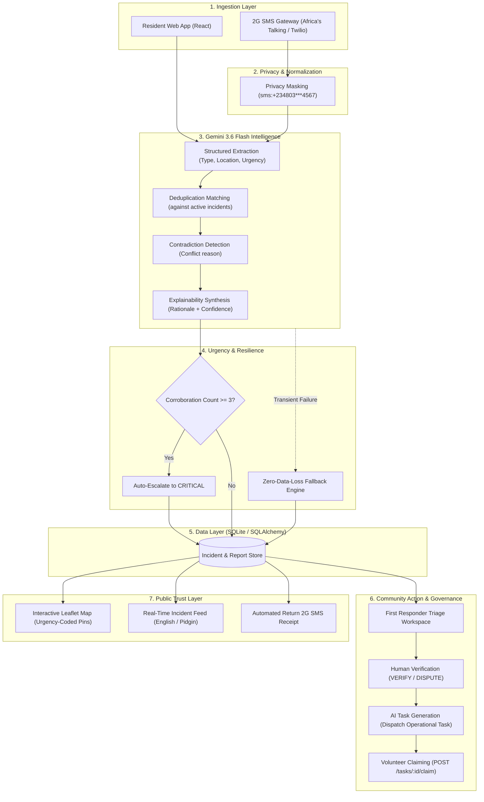

# Anya (Anyá) — Community Crisis Coordination Platform
> **Invention Sprint for Andela & Open Society Foundations (OSF)**  
> *Transformative Peace in Africa: Shifting Power to Communities*  
> **Tracks**: Stability & Social Cohesion *(Primary)* | Safety, Reporting & Protection *(Secondary)*

[](https://www.python.org/)
[](https://flask.palletsprojects.com/)
[](https://react.dev/)
[](https://vitejs.dev/)
[](https://ai.google.dev/)
[](https://leafletjs.com/)

---

## 1. Executive Summary

In times of natural disaster, infrastructure collapse, or civil dispute across Africa, centralized emergency helplines fail. Residents turn to social media and messaging channels, creating a flood of unverified, chaotic, and contradictory reports. Misinformation spreads rapidly, panicking neighborhoods and misdirecting scarce volunteer resources. Crucially, during severe weather or unrest, **cellular internet is frequently cut**, making web-only platforms useless for vulnerable populations on basic feature phones.

**Anya** (*"Eye"* in Igbo) is a decentralized, people-centered crisis coordination platform engineered for real African conditions. Powered by Google's **Gemini 3.6 Flash**, Anya:
1. **Ingests multi-channel reports** across modern web browsers and low-bandwidth **2G SMS gateways** without requiring internet access.
2. **Eliminates triage fatigue** through intelligent duplicate corroboration and semantic contradiction detection.
3. **Ensures radical explainability** by displaying confidence scores and transparent AI reasoning snippets on every incident card.
4. **Preserves human sovereignty**: AI recommends and extracts; local community responders authoritatively verify (`VERIFIED` / `DISPUTED`).
5. **Drives immediate civic action**: Automatically synthesizes operational mutual-aid tasks (`"Deploy rescue boat"`, `"Isolate sparking transformer"`) that volunteers can claim and resolve.

---

## 2. Alignment with Hackathon Core Criteria

### A. Challenge Track Fit
* **Track 1: Stability & Social Cohesion *(Primary Track)***:
  Anya resolves local disputes and rumor panic before escalation. When conflicting eyewitness reports arise during high-tension events (e.g., market fire caused by arson vs. an extinguished waste bin), Anya flags the contradiction immediately rather than letting unverified rumors incite community unrest.
* **Track 3: Safety, Reporting & Protection *(Cross-Track Synergy)***:
  Provides residents with an anonymous, secure channel to report immediate life-safety hazards, infrastructure collapse, and threats with clear pathways to rapid local volunteer response.

### B. Hackathon Design Principles Checklist

| Evaluation Criterion | How Anya Satisfies It |
|---|---|
| **Trust & Verification** | **Zero Black-Box AI**: AI proposes matches and flags conflicts; community leaders retain absolute deterministic authority to change verification state. Every decision includes an explainable AI rationale and confidence score. |
| **Low Bandwidth** | **2G SMS Webhook Simulator (`POST /webhooks/sms`)**: Ingests unstructured SMS reports from basic feature phones over cellular networks when mobile data cuts out. |
| **Privacy & Protection** | **OSF Human Rights Standard**: Citizen phone numbers are automatically masked (`sms:+234 803 *** 4567`) to protect whistleblowers and vulnerable community members from retribution. |
| **Multilingual Access** | **English & Nigerian Pidgin**: Instant dynamic interface toggle, bridging the digital divide for citizens who express urgent needs in colloquial Pidgin rather than formal English. |
| **Local Relevance** | **Authentic Nigerian Scenarios**: Seeded and benchmarked on real geographic and cultural realities across Lagos (Ajah, Balogun Market, Ikeja), Abuja (Wuse 2), and Ibadan (Ring Road). |
| **Clear Next Steps** | **Closed-Loop Action Cycle**: Ingestion $\rightarrow$ Triage $\rightarrow$ Human Verification $\rightarrow$ AI Task Generation $\rightarrow$ Volunteer Claiming $\rightarrow$ Public Resolution. |
| **Accessibility** | **High-Contrast Monochrome Console**: Standardized 8px/16px/24px spacing scale, system fonts, with urgency colors as the *only* chromatic elements for maximum legibility under stress. |

---

## 3. System Architecture & Information Flow



---

## 4. Ethical AI Framework: AI-Decided vs. Human-Decided

To honor the Open Society Foundations' focus on **human rights and community self-determination**, Anya enforces a strict boundary between automated intelligence and human governance:

| Action / Decision | Decided By | Rationale & Mechanism |
|---|:---:|---|
| **Attribute Extraction** | 🤖 **AI (Gemini)** | Normalizes noisy, panic-filled citizen text into structured entities (location, hazard type, urgency). |
| **Deduplication Matching** | 🤖 **AI (Gemini)** | Evaluates spatial and temporal overlap to prevent duplicate fragment cards from overwhelming boards. |
| **Contradiction Flagging** | 🤖 **AI (Gemini)** | Identifies mutually exclusive claims (e.g., "fire put out" vs "building ablaze") and tags incident as `disputed`. |
| **Confidence Scoring** | 🤖 **AI (Gemini)** | Generates explicit numerical certainty metrics (e.g. `93% confidence`) and cites specific landmarks. |
| **Urgency Auto-Escalation** | ⚙️ **Deterministic Rule** | When $\ge 3$ citizens corroborate an incident, the system escalates urgency to `CRITICAL` based on volume. |
| **Verification State Change** | 👤 **Human Responder** | **Only a verified community leader can mark an incident `VERIFIED` or `DISPUTED`.** AI is strictly prohibited from altering truth status autonomously. |
| **Task Generation** | 🤖 **AI (Assisted)** | Gemini suggests concise, actionable operational commands (e.g. *"Deploy rescue boat to Ajah bridge"*). |
| **Task Execution & Claim** | 👤 **Human Responder** | Community volunteers authoritatively claim responsibility and execute field operations. |

---

## 5. Local Nigerian Benchmark Scenarios

The platform includes seed data and end-to-end test fixtures modeled on authentic Nigerian crises:

1. **Lekki-Epe Expressway Flash Flood (Deduplication & Auto-Escalation)**:
   - Three independent eyewitness reports in English and Pidgin from *"Ajah bridge"*, *"Ajah underbridge towards Abraham Adesanya"*, and *"Ajah market"*.
   - **Result**: Gemini clusters all three into Incident #1, surfaces a 91% confidence spatial overlap rationale, and triggers auto-escalation to `CRITICAL`.
2. **Balogun Market Fire Dispute (Contradiction Detection)**:
   - Report A claims a massive commercial plaza fire with billowing black smoke.
   - Report B (on-scene shopkeeper) clarifies that only an extinguished waste bin caught fire and business is normal.
   - **Result**: Gemini flags `has_contradiction: true` with rationale: *"Eyewitness disputes active fire; source was an extinguished waste bin"*, immediately setting state to `disputed`.
3. **Aminu Kano Crescent Collapsed Power Line, Abuja (Task Flow & Resolution)**:
   - High-tension PHCN pole collapses across the roadway near Banex Plaza, sparking live wires.
   - **Result**: First Responder verifies the incident, Gemini synthesizes operational task: *"Isolate power grid with AEDC and establish safety perimeter"*, claimed by FRSC Unit 3.
4. **Municipal Infrastructure Variety**:
   - Burst water utility pipe on Isaac John Street, Ikeja GRA.
   - Storm tree branch partially blocking Ring Road near Challenge junction, Ibadan.

---

## 6. Technology Stack

* **Frontend**: React 19, Vite, Leaflet.js (Interactive mapping), Vanilla CSS (Custom design system).
* **Backend**: Python 3.11+, Flask (REST API & Webhooks), SQLite, SQLAlchemy ORM.
* **Artificial Intelligence**: Google Gemini 3.6 Flash (`google-genai` SDK) with structured JSON schemas, exponential backoff retries, and zero-data-loss fallback.
* **Geospatial**: Leaflet / OpenStreetMap tiles with custom SVG urgency-coded pin markers.
* **Localization**: Built-in bilingual dictionary (`translations.js`) supporting English and Nigerian Pidgin.

---

## 7. Quickstart Guide (Run Locally in 3 Minutes)

### Prerequisites
- Python 3.11+
- Node.js 18+ and npm
- Gemini API Key ([Get one free from Google AI Studio](https://aistudio.google.com/))

### Step 1: Clone the Repository
```bash
git clone https://github.com/your-username/anya.git
cd anya
```

### Step 2: Configure the Backend
```bash
cd backend
python -m venv .venv

# On Linux/macOS/WSL:
source .venv/bin/activate
# On Windows:
# .venv\Scripts\activate

pip install -r requirements.txt
cp .env.example .env
```
Open `backend/.env` and insert your Gemini API Key:
```env
GEMINI_API_KEY=your_actual_gemini_api_key_here
GEMINI_MODEL=gemini-3.6-flash
PORT=5000
```

### Step 3: Seed the Database
Populate the Nigerian crisis benchmark scenarios:
```bash
python seed_db.py
```

### Step 4: Run Automated Verification Suite
Verify the complete end-to-end golden path with zero failures:
```bash
python tests/verify_golden_path.py
```

### Step 5: Start the Backend Server
```bash
python app.py
# Backend runs on http://localhost:5000 (serves API and compiled frontend SPA)
```

### Step 6: Start the Frontend Application (Development Mode)
In a new terminal window:
```bash
cd ../frontend
npm install
npm run dev
# Frontend runs on http://localhost:5173 with hot-reloading
```

Open **`http://localhost:5173`** in your browser.

---

## 8. Deployment on Render (Docker)

Anya is fully dockerized and configured for zero-configuration, single-service deployment on **Render**:

### Option A: 1-Click Blueprint (`render.yaml`)
1. In the [Render Dashboard](https://dashboard.render.com), click **New +** $\rightarrow$ **Blueprint**.
2. Connect your GitHub repository. Render will detect `render.yaml` and provision:
   - A **Docker Web Service** running Gunicorn + Flask + compiled Vite SPA.
   - An optional **Managed PostgreSQL** database (or defaults to SQLite).
3. Add your `GEMINI_API_KEY` under Environment Variables.

### Option B: Manual Web Service
1. Click **New +** $\rightarrow$ **Web Service** $\rightarrow$ Build and deploy from a Git repository.
2. Select **Docker** as runtime.
3. Configure environment variables:
   - `GEMINI_API_KEY`: Your Google Gemini API Key.
   - `GEMINI_MODEL`: `gemini-3.7-flash` (or `gemini-3.6-flash`).
   - `DATABASE_URL`: (Optional) PostgreSQL connection string from Render Postgres.

### Step 7: Seed Production Database & Verify Live URL
```bash
# Seed production database from local machine or Render Shell:
DATABASE_URL="postgres://..." python backend/seed_db.py

# Confirm 100% pass on the live deployment URL:
python backend/tests/verify_live_deployment.py https://anya-crisis-platform.onrender.com
```

---

## 9. Testing the Features in the UI

1. **Test 2G SMS Ingestion**:
   - Click **`[ 📱 2G SMS Ingest Simulator ]`** in the top navigation bar.
   - Click the **"Ajah Flood Escalation"** quick scenario chip.
   - Click **"Send Inbound SMS"**.
   - Observe the 2-way phone thread receipt reply and watch Incident #1 update to `CRITICAL`.
2. **Inspect AI Rationales**:
   - Look directly at the incident cards in the feed or click **"View Details"** on Incident #1 or #2 to see the **`🤖 AI Triage Rationale`** and confidence scores.
3. **Toggle Nigerian Pidgin**:
   - Click **"Pidgin"** in the top-right language switcher to see the entire UI adapt to everyday Nigerian lingua franca.
4. **Interactive Map View**:
   - Click **`[ 🗺️ Map View ]`** to inspect urgency pins plotted across Lagos, Abuja, and Ibadan.
5. **Responder Command Console**:
   - Switch the active role toggle to **Responder** to review triage queues, dispute false alarms, verify critical emergencies, and claim action tasks.

---

## 10. Future Roadmap: From Invention Sprint to Pan-African Scale

- **Native USSD Integration (`*384#`)**: Partnering with telecom operators (MTN, Airtel, Safaricom) for menu-driven reporting on zero-balance feature phones.
- **WhatsApp Cloud API Integration**: Direct voice-note transcription using Gemini Multimodal Audio to allow illiterate citizens to report emergencies in local dialects (Yoruba, Hausa, Igbo, Swahili).
- **Offline-First PWA with Background Sync**: Service Worker + IndexedDB queue so field reports sync automatically the moment a responder reconnects to a mesh network.
- **Vector Retrieval Augmented Generation (RAG)**: Transitioning from sliding-window context to vector embeddings (`text-embedding-004`) in pgvector for continent-scale incident clustering.

---

## 11. License & Acknowledgments

Built for the **Andela & Open Society Foundations (OSF)** Invention Sprint, inspired by OSF's *Transformative Peace in Africa: Shifting Power to Communities* initiative and supported by **Build Up**.

Licensed under the [MIT License](LICENSE).

