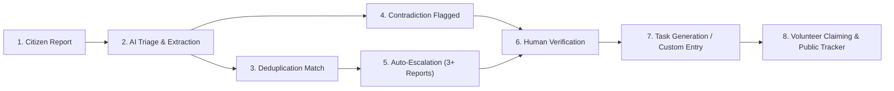

# Anya (Anyá) — Crisis Intelligence & Coordination Platform

> **Invention Sprint for Andela & Open Society Foundations (OSF)**  
> *Transformative Peace in Africa: Shifting Power to Communities*  
> **Track:** Stability & Social Cohesion — Crisis Coordination

[](https://www.python.org/)
[](https://flask.palletsprojects.com/)
[](https://react.dev/)
[](https://vitejs.dev/)
[](https://ai.google.dev/)
[](https://leafletjs.com/)

> *"Anyá"* is the Igbo word for **"Eye"** — reflecting the platform's core mission to act as a vigilant, clear-sighted observer and trusted coordinator during chaotic community crises.

---

## 1. The Problem

During a crisis, information is scattered across social media, chat groups, and word-of-mouth — fragmented, contradictory, duplicated, and impossible for emergency responders to act upon quickly. 

Eyewitnesses each possess a partial fragment of the truth, but communities lack a shared, verifiable operational picture. Rumors escalate tensions, false alarms misdirect scarce rescue resources, and vulnerable populations on basic feature phones are cut off whenever cellular internet falters.

---

## 2. What Anya Does

> **Report what you see. Verify what matters. Coordinate what needs to happen.**

1. **Effortless Citizen Reporting:** A resident submits an incident in plain language — no technical classification or crisis taxonomy required.
2. **AI-Powered Triage & Clustering:** Anya uses Google Gemini to extract structured attributes, cluster duplicate reports into a unified incident, and detect factual contradictions between eyewitness accounts.
3. **Preserving Human Sovereignty:** The AI never silently favors a side or deletes conflicting claims. Authoritative verification remains strictly in the hands of human responders (`VERIFIED` / `DISPUTED`).
4. **Actionable Micro-Tasks:** Verified incidents automatically synthesize operational mutual-aid tasks (or allow custom responder task creation) that local volunteer teams can claim and execute.
5. **Live Public Transparency:** Affected communities see real-time updates and "Response Underway" indicators as mutual aid mobilizes.

---

## 3. Core Flow (The Golden Path)



1. **Citizen Report Ingestion:** A resident submits an eyewitness description and landmark location.
2. **AI Extraction & Triage:** Extracts `incident_type`, specific `location`, `urgency` level, and `people_affected_estimate` (intentionally left blank if unstated to prevent hallucination).
3. **Semantic Deduplication:** Incoming reports describing the same physical crisis event are linked to the existing incident rather than cluttering feeds with duplicates.
4. **Corroboration Auto-Escalation:** Incidents with 3 or more independent corroborating reports automatically escalate in priority to `CRITICAL`.
5. **Contradiction Detection:** Contradictory eyewitness reports (e.g., claiming a fire is a false alarm or a blocked road is clear) are surfaced with an explicit rationale — both accounts are preserved, and the AI never unilaterally picks a winner.
6. **Authoritative Human Verification:** Trusted responders review field evidence and mark incidents as `VERIFIED` or `DISPUTED`.
7. **Task Synthesis & Custom Entry:** Verified incidents generate actionable operational tasks (e.g., *"Deploy 2 inflatable rescue boats to Elm St"*). Responders can also input custom operational tasks whenever specialized field needs arise.
8. **Public Response Tracker:** When responders or volunteer teams claim an open task, public feeds instantly display a **"Response Underway"** indicator with the active dispatch unit.

---

## 4. Additional Capabilities

The following capabilities are implemented to extend real-world crisis resilience beyond the core golden path:

* 📱 **Low-Bandwidth 2G SMS Gateway (`POST /webhooks/sms`):** Ingests reports over basic cellular SMS when mobile internet is down, featuring an in-app interactive SMS simulator for offline testing.
* 🔒 **Citizen Privacy & Whistleblower Masking:** Automatically masks phone numbers (`sms:+234 803 *** 4567`) to protect citizens and vulnerable whistleblowers from retribution.
* 🇳🇬 **Nigerian Pidgin Interface Toggle:** Instant dynamic switch between English and Nigerian Pidgin for primary navigation, buttons, and triage metrics to broaden accessibility across linguistic lines.
* 🗺️ **Interactive Geospatial Map:** Leaflet.js-powered map with urgency-coded visual markers for situational awareness across affected districts.
* 🤖 **Explainable AI with Confidence Metrics:** Every triage decision includes an explainable rationale snippet and confidence score to eliminate black-box decision-making.

> [!NOTE]
> *These secondary features were designed and tested to demonstrate architectural viability alongside the primary golden path.*

---

## 5. System Architecture & Tech Stack

* **Frontend:** React 19, Vite, Leaflet.js (geospatial mapping), custom responsive CSS design system.
* **Backend:** Python 3.11+, Flask (REST API & SMS Webhooks), SQLAlchemy ORM, Gunicorn.
* **Database:** SQLite (local development) / PostgreSQL (production).
* **Artificial Intelligence:** Google Gemini 3.6 Flash via the official `google-genai` SDK with Pydantic structured output schemas, exponential backoff retries, and zero-data-loss deterministic fallback.
* **Localization:** Bilingual translation dictionary (`translations.js`) supporting English and Nigerian Pidgin.

---

## 6. Getting Started (Local Development)

### Prerequisites
* Python 3.11+
* Node.js 18+ and npm
* Google Gemini API Key ([Get one from Google AI Studio](https://aistudio.google.com/))

### 1. Clone the Repository
```bash
git clone https://github.com/Damianson/anya.git
cd anya
```

### 2. Backend Setup
```bash
cd backend
python -m venv .venv

# On Linux/macOS/WSL:
source .venv/bin/activate
# On Windows:
# .venv\Scripts\activate

pip install -r requirements.txt
cp .env.example .env
```

Configure your `backend/.env` file:
```env
SECRET_KEY=dev-secret-key-change-in-production
DATABASE_URL=your-db-url
PORT=5000
GEMINI_API_KEY=your_actual_gemini_api_key_here
GEMINI_MODEL=gemini-3.6-flash
```

Initialize and seed the database with benchmark Nigerian crisis scenarios:
```bash
python seed_db.py
```

Run the backend server:
```bash
python app.py
# Backend API & static bundle runs on http://localhost:5000
```

### 3. Frontend Setup (Development Server)
In a separate terminal window:
```bash
cd frontend
npm install
npm run dev
# Frontend development server runs on http://localhost:5173
```

---

## 7. Automated Verification & Testing

The repository includes comprehensive automated test suites to verify system behavior, AI schemas, and crisis workflows:

```bash
# 1. Full end-to-end golden path verification (in-process)
python backend/tests/verify_golden_path.py

# 2. Custom task creation & AI suggested task generation test
python backend/tests/test_custom_tasks.py

# 3. Comprehensive multi-scenario AI triage and deduplication test
python backend/tests/test_ai_pipeline.py

# 4. Responder workflow verification (verify, dispute, claim tasks)
python backend/tests/test_responder_flow.py

# 5. Live deployment verification against any URL
python backend/tests/verify_live_deployment.py https://<your-deployed-url>

# 6. Reset database to clean benchmark data
python backend/seed_db.py
```

---

## 8. Known Limitations & Intentional Scope

* **Affected-People Estimates:** Intentionally left blank (`null`) when a report does not explicitly state a casualty count, rather than hallucinating an estimate.
* **AI Fallback Resilience:** When API limits or network disruptions occur, the system falls back to a deterministic rule-based triage ensuring zero citizen data loss.
* **Render Free-Tier Spin-Down:** On free cloud tiers, containers sleep after 15 minutes of inactivity. Initial wake-up takes approximately 15–20 seconds.
* **SMS Gateway Simulation:** The 2G SMS webhook is fully functional and accepts live HTTP payloads; the UI simulator enables testing without needing active third-party telecom credentials (e.g. Africa's Talking / Twilio).
* **Pidgin Localization Scope:** The Pidgin toggle localizes core interface elements, navigation controls, and triage buttons. Raw user report text and dynamically generated AI rationales remain in their original submission language.

---

## 9. Future Roadmap

* 📡 **Direct USSD & Telco SMS Integration:** Native shortcode connectivity via Africa's Talking and Twilio for completely offline mobile phone reporting.
* 🌍 **Expanded Indigenous Language Models:** Fine-tuned multilingual extraction across Yoruba, Hausa, Igbo, and Swahili.
* 🛡️ **Cryptographic Audit Trail:** Verifiable append-only logs for tamper-evident tracking of crisis verification actions.
* 📦 **Offline-First PWA Sync:** Client-side IndexedDB caching and background sync for submitting reports across intermittent 2G/3G connectivity.